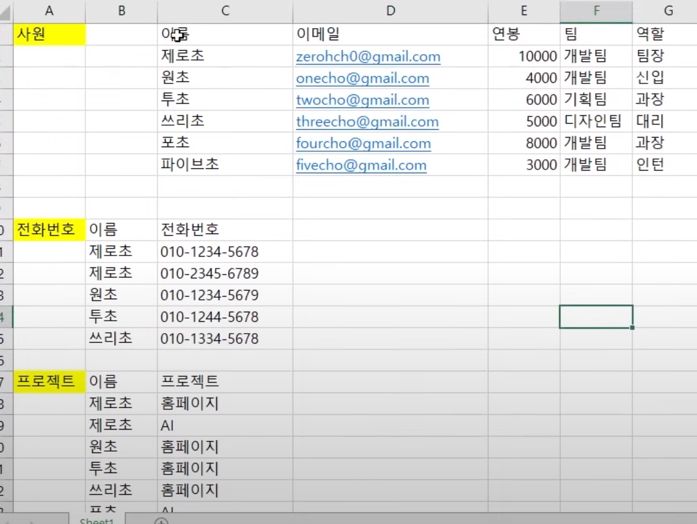
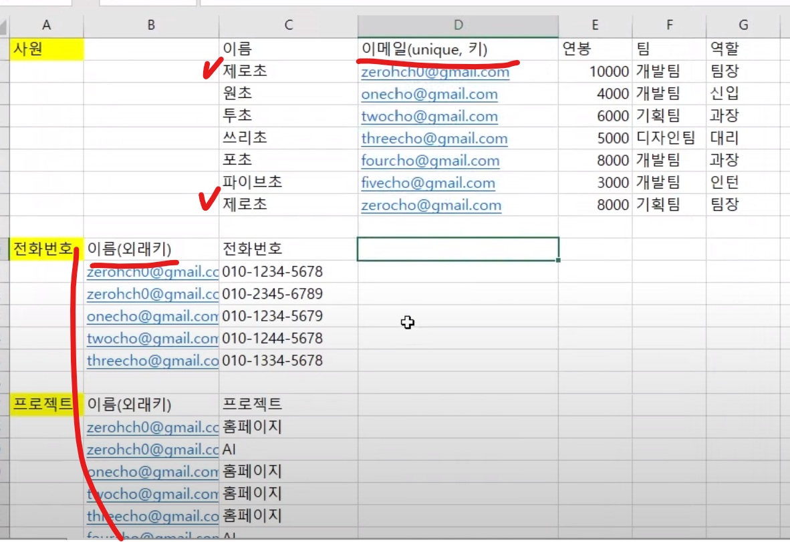
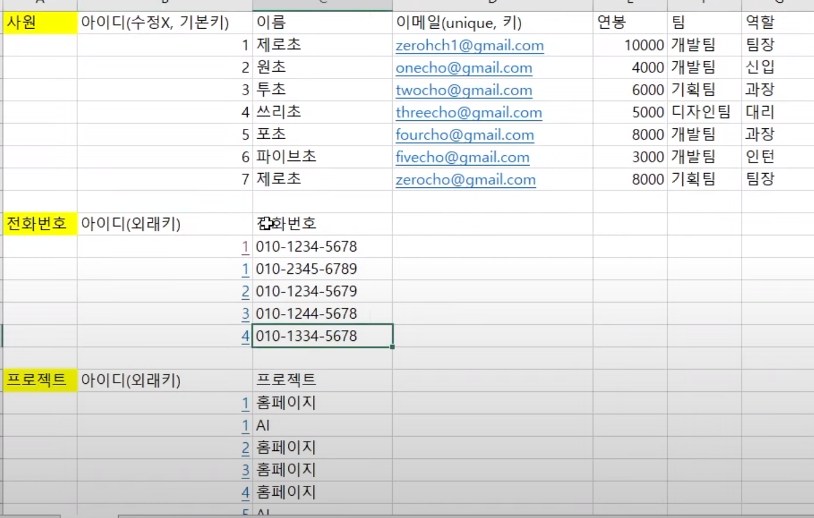
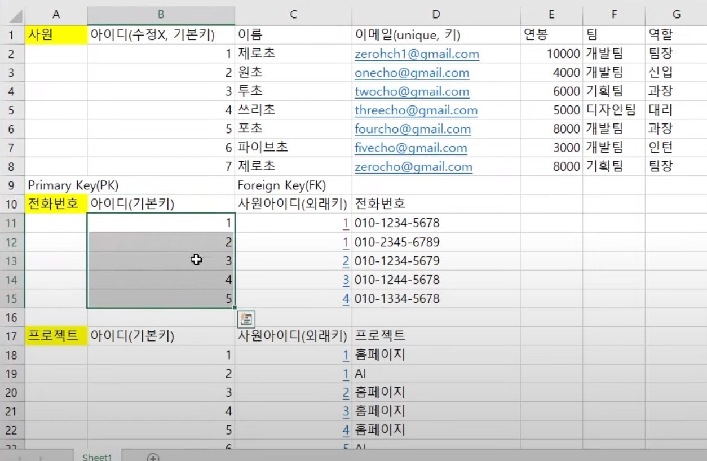

## 테이블 만들기

- 데이터를 어떤 형식으로 저장할 지 먼저 생각 → 엑셀이라 생각(엑셀스라는 DB 가까운 서비스가 있긴 함)
- **데이터를 저장하는 2차원 공간**
- 엑셀이라고 생각해보자(row, column)
- 데이터가 두개 이상이어도, 비어있어도 된다(여부에 맞게)
- **column**: 열, 세로축, ‘**데이터의 이름**’. 데이터를 대표하는 이름
- **row**: 행, 하나하나의 ‘**실제 데이터**’

- 실제로 이렇게 테이블을 만들면 문제가 많이 생김 → 문제 해결을 위해 정규화(ERD 등)를 함
  - 엑셀과 DB랑 다른점이 있음

## 정규화(Normalization)

- **테이블을 [정규형](https://ko.dict.naver.com/#/entry/koko/36eeed1b72ca4224a00ddc5633323e96)으로 만드는 걸 정규화**라고 한다.
- 전문적으로는 엑셀이라고 생각하면 안된다
- **삽입, 수정, 삭제 시 문제가 없나 생각해보기** → 해당 문제를 해결하는 것을 정규화

### 1NF

- **각 칸은 쪼갤수 없는 데이터로 구성되어야 한다.**
  - 구성 요소별로 기준치를 둘 수 있다.(전화번호의 하이픈은 그냥 두기 등)

한 컬럼에 값이 두 개...? → 전화번호 테이블을 새로 만들어 나누고 기존 테이블에 있는거 지우기

프로젝트도 마찬가지

| 이름          | 전화번호      |
| ------------- | ------------- |
| 제로초        | 010-1234-5678 |
| 010-2345-6789 |

- id로 row 구별.
- 동명이인이 있을 수 있음. 위에는 이름을 고유하다고 생각해서 연결시켰는데 동명이인이면 문제생김 → 고유한 이메일로 변경
- **고유한 것을 key**라고 함. key는 고유하기에 **다른 테이블에 들어갈 수 있음**
- 사실 사원에서는 이메일이 고유한 key지만, 전화번호나 프로젝트는 고유하지 않음
  - **남의 테이블의 이름을 가져온 것**이므로, 전화번호, 프로젝트의 이름은 ‘**외래키**’ 라고 부름
- 처음에 테이블 만들 때 키 선정 잘해줘야 함
  
- 만약 키에서 하나를 바꿔준다면(이메일을 바꾼다면) 외래키까지 다 바꿔줘야하는 번거러움(수정 부분 문제)
  - 실수를 방지하려면, 애초에 **절대 바뀌지 않을 값을 키로 지정**해줘야 한다
  - 바뀌지 않는 키로 쓸만한게 없다 → 아이디 만든다.(sang6299)
  - 아이디는 안바껴서가 아닌, 고유해서 아이디.
  - 근데 또 혹시 바뀔 수 있으니 걍 애초에 1,2,3,4 혹은 사번으로 key로 하기.
  - 절대 수정할 수 없도록 하기
  - 즉 **id**는 의미가 없지만 절대 바뀌지 않는 상황을 만들기 위해 둠. 이를 ‘**기본키**’라고 부름
  - 단점은 누가 누군지 매칭이 잘 안됨. 어쩔 수 없음

- 전화번호 테이블에서 key - 전화번호가 고유하니까 key가 될 수 있음. 근데 전화번호도 바뀔 수 있다. 아이디도 중복되므로 key로 쓰기 애매.
  - 컬럼 자체를 key로 쓸 수 있다.(복합키) 근데 또 전번 바뀔 수 있으니 애매..
  - 걍 여기에도 id 또 만듦
- **기본키 - Primary Key(PK) / 외래키 - Foreign Key(FK)**

- **기본키가 21adsjasfs 이렇게 알수 없는 문자로 만들 수 있도록 하는 방법이 있음(알고리즘)**
  - 겹칠 확률이 로또 보다 작음
  - short ID, **[nano ID](https://www.npmjs.com/package/nanoid)** 등 있음.
  - 1,2,3,4 이렇게 되면 회원수, 게시물 수 간접적으로 알 수 있음(어떤 곳에서는 소중한 회사 정보일 수도 있음)
  - 보통 주소창에서 드러남
    - 순서대로 쌓이는 아이디가 아닐 수 있음

가로로 배치..? → 전화번호 하나 더 생기면 컬럼 하나 더 만들어야함

컬럼을 하나 더 늘리는건 훨씬 더 어려운 일

테이블 만들때 웬만하면 빈칸은 안만드는게 나음

| 이름   | 전화번호1     | 전화번호2     |
| ------ | ------------- | ------------- |
| 제로초 | 010-1234-5678 | 010-2345-6789 |

| 이름   | 전화번호      |
| ------ | ------------- |
| 제로초 | 010-1234-5678 |
| 제로초 | 010-2345-6789 |

- 나중에 JOIN으로 합침
