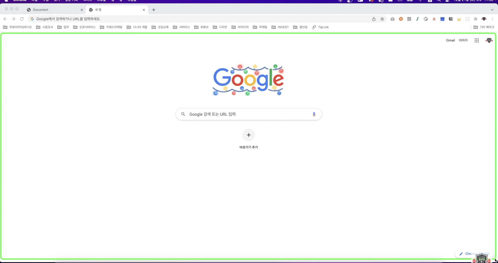

# DOM

- js: 웹(html)문서 제어를 위한 언어
- html 파일을 js로 어떻게 제어하는가?
  → 브라우저 안에는 웹 문서를 해석할 수 있는 렌더링 엔진이 있음.
  
  → 브라우저로 렌더링 파일을 열면 html 코드를 한줄한줄 해석함.
  → 이것을 객체화 시킴(DOM)
  → js로 접근하도록 함
- 문서 접근 모델이라 하여 DOM(document object model)이라 부르는 것.
- DOM은 tree 구조. 하나의 부모태그와 n개의 자식 구조


- 각각의 요소를 노드라 부름
- js 해당 요소에 접근한 뒤 제어를 한다.



- 표시 부분이 DOM, 그 위에 탭부분까지 총칭해서 BOM(Browser Object Model)
  - CSS를 JS로 조작할수 있는 모델을 CSSOM
- document : 표시부분인 웹문서 부분을 제어할 수 있도록 하는 객체
  - 웹 페이지 자체를 의미
  - DOM트리 최상위 노드(DOM 요소에 접근하기 위한 진입점)
- DOM은 문서 객체모델. 브라우저에서 js로 html 요소를 제어할 수 있도록 제공하는 API(브라우저에서 제공하는 기능을 API라고 함)

```jsx
document.childNodes[번호].textContent = "변경"; // 선택한 요소의 text를 '변경'으로 변경
```


- 위 방식은 찾고자 하는 요소를 DOM tree의 최상위 노드에서 하나하나 뻗어가며 찾는 방법. 하지만 보통은 아래와 같이 함

```jsx
document.querySelector("h1");
```


# 참고

https://www.inflearn.com/course/%ED%94%84%EB%A1%A0%ED%8A%B8%EC%97%94%EB%93%9C-%EB%82%A0%EA%B0%9C%EB%8B%AC%EA%B8%B0
