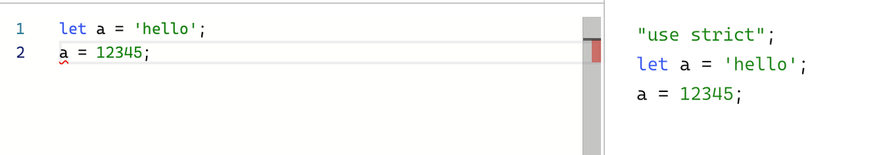

# TypeScript

- [제로초님의 TS강의](https://www.inflearn.com/course/%ED%83%80%EC%9E%85%EC%8A%A4%ED%81%AC%EB%A6%BD%ED%8A%B8-%EC%98%AC%EC%9D%B8%EC%9B%90-1/dashboard)를 듣고 정리한 내용

## 기본 지식

- **메인 룰: typescript는 최종적으로 javascript로 변환된다.** 순전한 typescript 코드를 돌릴 수 있는 것은 deno이나 대중화되지가 않았음. 브라우저, 노드는 모두 js 파일을 실행한다.
  - js에 type을 입힌 것. ts로 짤 수 있는건 js로도 짤 수 있다.
  - deno는 바로 ts로 실행시킬 수 있음. js로 변환 안해도 됨. 근데 node도 뛰어넘지 못해서 ts를 돌릴 수 있는 대중적인 런타임(브라우저+nodejs)은 존재하지 않음.
- typescript는 언어이자 컴파일러(tsc)이다. 컴파일러는 ts 코드를 js로 바꿔준다. → 그걸 이제 node나 브라우저에서 돌릴 수 있는 거임
  - 컴파일러보단 트렌스파일러 역할이 더 맞긴 함.
  - 어떻게 바꿀지 옵션에 따라 결과물이 달라짐
- tsc는 **tsconfig.json**(tsc --init 시 생성)에 따라 ts 코드를 js(tsc 시 생성)로 바꿔준다. 인풋인 ts와 아웃풋인 js 모두에 영향을 끼치므로 tsconfig.json 설정을 반드시 봐야한다.
  - tsc가 보는 가장 핵심적인 파일
- 단순히 **타입 검사**만 하고싶다면 tsc --noEmit 하면 된다.
  - js 변경과는 별개의 기능. 타입 에러는 뜨지만 실시간으로 js로 변환됨. js적으로는 아무런 문제 없는 코드이기에.
  - 하지만 우리는 아무 에러가 없는 코드를 짜야한다.
    
- 개인 의견: tsconfig.json에서 그냥 esModuleInterop: true, strict: true 두 개만 주로 켜놓는 편. strict: true가 핵심임.
- ts 파일을 실행하는 게 아니라 결과물인 js를 실행해야 한다.
  - 최종적으로 js가 실행되는거기에 항상 js도 생각하고 있어야함.
- 에디터가 필수가 됨. VS Code나 웹스톰 반드시 필요. 메모장으로 코딩 불가능한 지경에 이름.
  - 타입검사를 알아서 해줌

---

- 새폴더, 파일을만든다.
- `npm init -y`
  - node project가 됨.
  - package.json: node 프로젝트의 설정들
- npm: node의 패키지. 노드의 프로그램들을 모아둔 저장소.
- ts 설치: `npm i typescript`
- tsc 설치: `npx tsc`
  - npm으로는 안됨
- 터미널에 어떤 명령어를 쳤을 때 나오는 말들은 한번 쯤 읽어보는게 좋음
- `npx tsc --init` : tsconfig.json 파일 생성
  - 코드가 뭘 뜻하는지 알아야한다.
  - “allowJs”: true → TS와 JS 동시에 사용 가능. 그 상태에서 JS를 조금씩 TS로 전환하기
  - strict는 항상 true로 하기. 안하면 TS를 쓰는 의미가 없음.
  - “target”: “es2016” → es2016으로 변환
  - "module": "ES2015” → 최신 모듈 시스템으로 쓰고 싶을때. 노드 모듈 시스템 쓰고싶으면 CommonJS
  - "forceConsistentCasingInFileNames": true → import할 때 파일명 대소문자 구별. 윈도우는 상관없는데 Mac이나 리눅스에서는 에러가 뜨므로.
  - "skipLibCheck": true → 실제로 쓰는 라이브러리들의 타입만 검사(다 하면 컴파일러가 느려지므로)
    - .d.ts 파일: 그 패키지의 타입을 싹 정리 해둔 파일
- `npx tsc --noEmit` : 타입 검사한 내역이 나옴. 근데 에디터 사용하면 이 명령어를 계속 꾸준히 입력해줘서 내가 직접 안쳐봐도 됨
- `npx tsc` : ts 파일을 js 파일로 바꿔줌. type에 에러가 있어도 js는 상관이 없으므로 제대로 변경은 됨.
